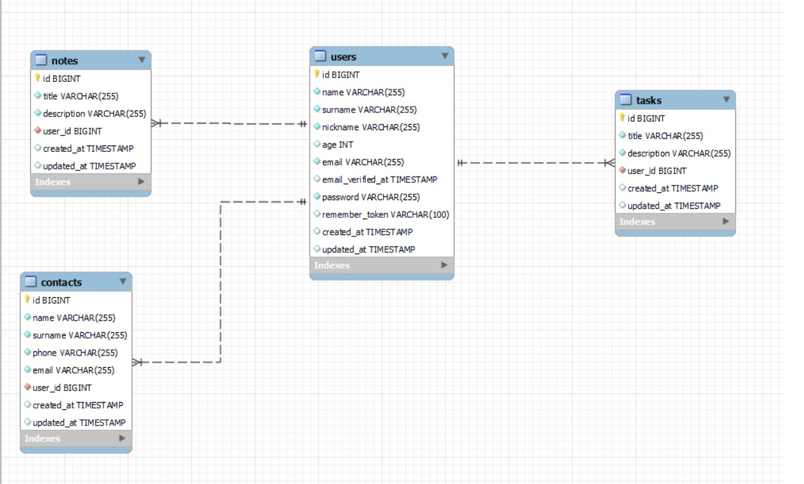
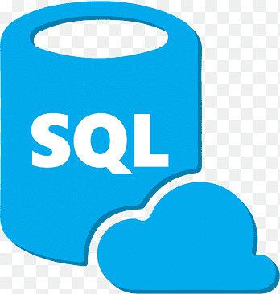

## Backend Agenda

:wave: Soy Raquel Moya. 

### Sobre el proyecto

Os presento aquí una prueba técnica que consiste en crear una app de una agenda personal. En este repositorio encontraremos todo lo referente al backend. 

La base de datos utilizada es SQL, y para el backend escogido utilizaremos PHP y Laravel.

### Instrucciones 🔧

El proyecto está deployado en Heroku para poder acceder a la API de forma remota. Se puede acceder a todos los endpoints utilizando lo siguiente como raiz: 

https://rocky-retreat-20214.herokuapp.com/

A continuación tenemos las instrucciones por si es necesario acceder de manera local:

El primer paso para arrancar el proyecto es clonar este repositorio en vuestro repositorio local.

A continuación, debemos instalar las dependencias no incluidas en el repositorio al utilizar el archivo .gitignore. Para ello, debemos introducir en el terminal el siguiente comando: 

### `composer install`

Realizamos la migración de los modelos a la base de datos local.

Dado que Laravel trae por defecto el archivo .env, y nosotros no lo subimos al repositorio remoto al estar incluido en el .gitignore, deberemos configurar las variables de entorno referentes a la base de datos con nuestros datos de BBDD local. 

A continuación ejecutaremos el siguiente comando para que nos incluya en el .env un código encriptado:

### `php artisan jwt:secret`

Generamos las migraciones:

### `php artisan migrate`

Levantamos el servidor para acceder a los endpoints mediante Postman.

### `php artisan serve`

Y ya podríamos ir a Postman para probar todos los endpoints.

## Endpoints

Al levantar el servidor nos muestra en consola la raiz sobre la que tenemos que basar nuestros endpoints, en este caso es: 

### `http://127.0.0.1:8000`

A continuación se especifican el método a introducir en Postman, y lo que debemos introducir a continuación de la raiz para acceder a cada uno de los endpoints.

TASKS
- GET: /api/task/{id} -> Muestra una tarea por su id.
- POST: /api/task -> Crea una nueva tarea.
- DELETE: /api/task/{id} -> Elimina una tarea por su id.
- PUT: /api/task/{id} -> Modifica una tarea por su id.
- GET: /api/tasks_user -> Muestra todas las tarea del usuario.
- GET: /api/tasks_title/{title} -> Muestra una tarea por su título.

NOTES
- GET: /api/note/{id} -> Muestra una nota por su id.
- POST: /api/note -> Crea una nueva nota.
- DELETE: /api/note/{id} -> Elimina una nota por su id.
- PUT: /api/note/{id} -> Modifica una nota por su id.
- GET: /api/notes_user -> Muestra todas las nota del usuario.
- GET: /api/notes_title/{title} -> Muestra una nota por su título.

CONTACTS
- GET: /api/contact/{id} -> Muestra un contacto por su id.
- POST: /api/contact -> Crea un nuevo contacto.
- DELETE: /api/contact/{id} -> Elimina un contacto por su id.
- PUT: /api/contact/{id} -> Modifica un contacto por su id.
- GET: /api/contacts_user -> Muestra todas las contacto del usuario.
- GET: /api/contacts_name/{name} -> Muestra un contacto por su nombre.

AUTH
- POST: /api/register -> Crea un nuevo usuario.
- POST: /api/login-> Loguea con un usuario.

USERS
- POST: /api/logout -> Desloguea al usuario logueado.
- GET: /api/me -> Muestra la información del usuario.
- DELETE: /api/user/{id} -> Elimina al usuario por su id.
- PUT: /api/user/{id} -> Modifica al usuario por su id.

## Models relation

## Tecnologías y dependencias utilizadas

 

 

## Developers ✍️

[Raquel Moya](https://github.com/RaquelMoya)

Última edición: 11/04/2022
